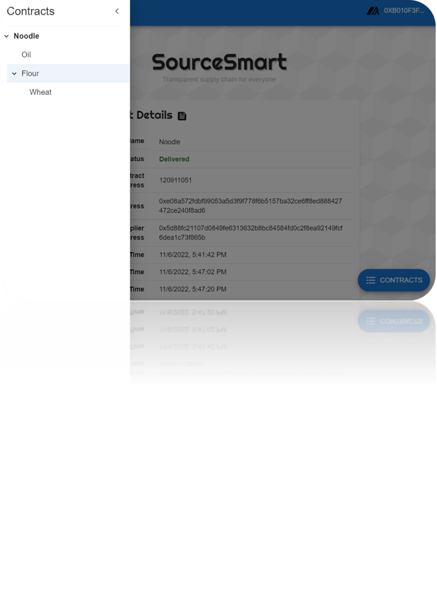

# SourceSmart - Fully Transparent Supply Chain for the Public. 📦

## Deployed Application 🔗

The application is deployed through Vercel on the following links:

1. [SourceSmart MyAlgo](https://sourcesmart-algo.vercel.app/)
2. [SourceSmart ETH](https://sourcesmart.vercel.app/)

As you can see, there are 2 versions of our application: 

1. The first one has `REACH_CONNECTOR_MODE` set to `ALGO` to use with MyAlgo wallet 
2. Another has `REACH_CONNECTOR_MODE` set to `ETH` which may use MetaMask. 

This is a `create-react-app` project. If you want to run it locally:

1. Clone the repository.
2. Run `npm i` from the root directory. You need to have `npm` installed.
3. Run `npm start`.

---
 

## Overview 👀

SourceSmart is a web3 blockchain application that allows the public to track and trace the origin of any registered product, from the raw materials to the final product. 

Buyers and the Suppliers use SourceSmart to register a product as well as its origin, and the consumers use SourceSmart to view the product's origin and verify its authenticity.

**The flow goes as follows:**

1. Buyer creates a contract with the ingredient's details and the supplier's address.
2. Supplier attaches to, and views the contract, accepts it, and adds the ingredient to the contract. (Or rejects it)
3. Buyer receives the goods and finally mark the contract as delivered.
4. QR code is generated, printed on the product and the contract information is accessible to the public.

**Feature Highlights:**

- **Publicly Accessible, Fully Transparent Supply Chain.** If a product supply chain is `[A -> B -> C -> D]` each representing a contract, the application provides a convenient tree view that allows you to trace the origin of the product from D to A even though you only have the QR code of D.

- **QR Code Scanning and Generation:**
  1.  When the buyer deploys, a QR code is generated for the supplier to attach to the contract. 
  2.  Supplier can add ingredients to the contract by QR code scanning
  3.  Once the contract is delivered, a QR code is generated for the product. QR code can be printed on the product and scanned by the public to view the entire supply chain.

- **No Disconnection Problem**. The backend utilizes API calls, which can be called anytime from the frontend. Therefore there will be no problems with closing the application in the middle of the process - You can always attach back anytime.

- **Two Blockchains**. Thanks to Reach, the application can be used on both **Ethereum** and **Algorand** blockchains. 

---
 

## Demo Video:

[Youtube Link Here](https://youtu.be/cAmsWFIA6ic)

---
 

## Project Structure

SourceSmart is a React application, and thereby follows the standard React project structure. The main source code is in the `src` folder:

1. `context` - React Context API for global state management
1. `reach-backend` - Reach backend code. Contains `index.rsh` and compiled `index.main.mjs` file.
1. `styles` - CSS file
1. `views` - Pages of the application
1. `App.js` - Entry point of the React application
1. `AppRoutes.js` - React Router routes
1. `Util.js` - Contains common utility functions, mainly the ones that interact with the Reach backend, like API calls, wallet connection, and contract attachment.
